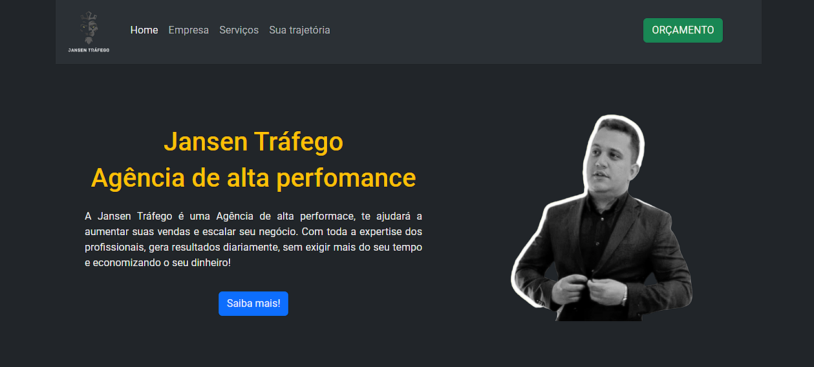

# Jansen Tráfego Pago

Projeto real para uma empresa de Tráfego Pago. Estará em constante aprimoramento, a medida da necessidade do cliente.

## 🚀 Sobre mim
Eu sou Desenvolvedor Front-end e venho postando meus projetos aqui no Github frequentemente. As principais tecnologias utilizadas até então são: HTML, CSS, Javascript, Bootstrap e um pouco de React.

## Meu contato

📫 Você pode entrar em contato comigo pelo linkedin: https://www.linkedin.com/in/wallacebps/

## Screenshots

## Referência

 - [Bootstrap 5](https://getbootstrap.com/)

 

## Tecnologias utilizadas

**Front-end:** HTML, CSS, Javascript, Bootstrap, Git.

## 🔗 Links

